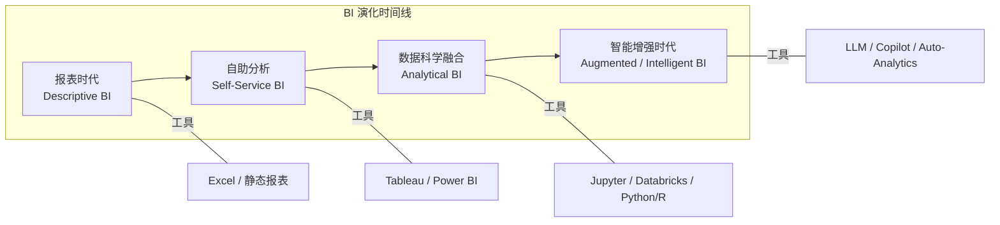

# BI 宇宙 — Mermaid 可视化

下面给你两种 Mermaid 图：**（A）整体谱系图（层级/星系视角）**，和 **（B）演化时间线（从报表到智能 BI）**。你可以把它们直接复制到支持 Mermaid 的编辑器（如 Obsidian、Mermaid Live Editor、Typora、GitHub README、Notion 的 Mermaid block 等）中渲染。

---

## A. 整体谱系图（层级/星系视角）

### ☀️ 核心恒星：BI 中心

- BI 核心（从数据到洞察的能力）
  - 数据建模 (Data Modeling)
  - 指标体系 (Metrics System)
  - 可视化与报告 (Visualization)
  - 数据分析方法 (Analysis Methods)
  - 决策支持 (Decision Intelligence)

---

### 🪐 行星系统：核心轨道环绕 BI

#### 轨道 1：数据基础轨道（离中心最近）

- 数据工程 (Data Engineering)
  - ETL / 数据管道
  - 数据仓库 / 数据湖
- 数据库系统 (DB Systems)
  - SQL / 索引 / 并行计算

#### 轨道 2：分析方法轨道（中层）

- 统计学与概率论 (Statistics & Probability)
  - 假设检验 / 回归 / 贝叶斯推断
- 商业与管理科学 (Business & Management)
  - 财务指标 / 市场分析 / 供应链指标

#### 轨道 3：呈现与洞察轨道（离中心较远）

- 信息设计与认知心理 (Info Design)
  - 仪表板设计 / 信息可视化 / 图表心理学
- 人工智能与机器学习 (AI/ML)
  - 预测分析 / 异常检测 / 自动洞察

---

### 🌠 知识星团：相对位置与远近

- ⭐ 数据治理 (Data Governance) —— 靠近数据基础轨道
- ⭐ 数据战略 (Data Strategy) —— 介于分析方法轨道和决策轨道之间
- ⭐ 数据产品 (Data Product) —— 靠近呈现与洞察轨道
- ⭐ 自动化分析 (Auto Analytics) —— 远离中心，跨越多个轨道
- ⭐ 决策科学 (Decision Science) —— 环绕决策支持轨道
- ⭐ 实验与因果分析 (Causal BI) —— 靠近统计学轨道

---

### 🔭 注释

- **轨道距离中心** ≈ 知识离决策的直接影响程度
  - 离中心越近，越“基础”，越支撑核心 BI
  - 离中心越远，越偏战略或前沿
- **星团位置** ≈ 知识应用或跨领域性质
  - 可以在多轨道之间跨越，形成“流动知识带”

啊，这里要澄清一下！你提到的能量流向逻辑很关键，我帮你理顺一下：

---

## 1️⃣ 能量流向的层次逻辑

```
恒星（BI 核心）
    → 行星（轨道模块：数据、分析、呈现）
        → 星团（知识星团：辅助、支撑决策）
            → 延伸带星团（前沿知识、自动化/产品化能力）
                → 企业决策 / BI 实践
```

解释：

- **恒星 → 行星**：核心 BI 的能力为业务分析提供基础支撑。
- **行星 → 星团**：常规知识星团（如数据治理、决策科学）直接增强分析精度和决策可靠性。
- **星团 → 延伸带**：延伸带星团提供 **前沿能力和智能化扩展**，如自动化分析、因果分析、数据产品化。
- **延伸带 → 企业实践**：这些能力最终以 **可复用、可自动化、可规模化的方式**直接作用到企业决策或业务执行。

---

## 2️⃣ 关于距离感

- 在 **空间/ASCII 宇宙图**里：

  - 延伸带看起来“离中心更远”，表示它是**战略性、前沿、跨轨道的能力**。
  - 但从**能量流向/价值落地**来看，延伸带实际上 **直接触达企业决策和 BI 实践**，甚至比常规知识星团作用更直接、可量化。

- 换句话说：

  - **视觉距离 ≠ 价值距离**
  - 延伸带“远离恒星”，强调它不是日常分析基础，而是前沿扩展
  - 但**落地价值反而可能比普通星团更接近企业业务**

---

💡 简单比喻：

- 核心恒星 = 能量源
- 行星 = 能量转换器（分析模块）
- 星团 = 能量调节装置（辅助决策能力）
- 延伸带 = 高压能量管道，**直接把能量输送到企业执行端**

---

如果你愿意，我可以帮你画一张 **带箭头的“能量流向 BI 宇宙图”**，把恒星、轨道、星团、延伸带与企业决策的关系都标清楚，看起来直观又逻辑清晰。

你希望我画这个图吗？

```markdown
           # 🌌 BI 宇宙能量流向图

                           🌠 知识星团
                 ┌───────────────┬───────────────┐
                 │               │               │
             数据治理        决策科学       数据战略
                 │               │               │
                 ▼               ▼               ▼

                🪐 轨道 3：呈现与洞察轨道
                ┌─────────────────────────┐
                │ 信息设计 │ AI/ML │
                └─────────────────────────┘

               🪐 轨道 2：分析方法轨道
               ┌─────────────────────────┐
               │ 统计学/概率论 │ 商业与管理科学 │
               └─────────────────────────┘

             🪐 轨道 1：数据基础轨道
             ┌─────────────────────────┐
             │ 数据工程 │ 数据库系统 │
             └─────────────────────────┘

                      ☀️ 核心恒星：BI
          ┌─────────────────────────────────┐
          │ 数据建模 │ 指标体系 │ 可视化 │ 数据分析 │ 决策支持 │
          └─────────────────────────────────┘

                     🌠 星团延伸带（前沿/战略）
        数据产品      自动化分析      实验与因果分析
           ⭐               ⭐               ⭐
           │               │               │
           ▼               ▼               ▼
             ┌─────────────────────────┐
             │       企业决策 / BI 实践        │
             │ 落地应用、策略执行、智能化闭环 │
             └─────────────────────────┘

# 🔹 能量流向说明：

- 恒星 → 行星：核心 BI 能量支撑分析模块
- 行星 → 星团：分析能力被知识星团增强和规范
- 星团 → 延伸带：前沿/自动化/数据产品化能力形成高级价值
- 延伸带 → 企业决策：最终直接驱动企业执行和业务落地
```

---

## B. 演化时间线（从报表时代到智能 BI）



---

如果你希望：

- 把 **A 图** 变成更“宇宙风”（比如不同群组用颜色、圆形布局、节点大小表示重要性），我可以给你带有样式的 Mermaid 版本（注意：部分渲染器对 style 支持有限）。
- 或者把这两张图合并为一幅更大的图（含交互链接 / 注释），我可以直接生成合并版。

你想要哪种下一步？要不要我把 diagram 转成单张 PNG（若你本地/工具能渲染的话我也可以给出渲染建议）？
