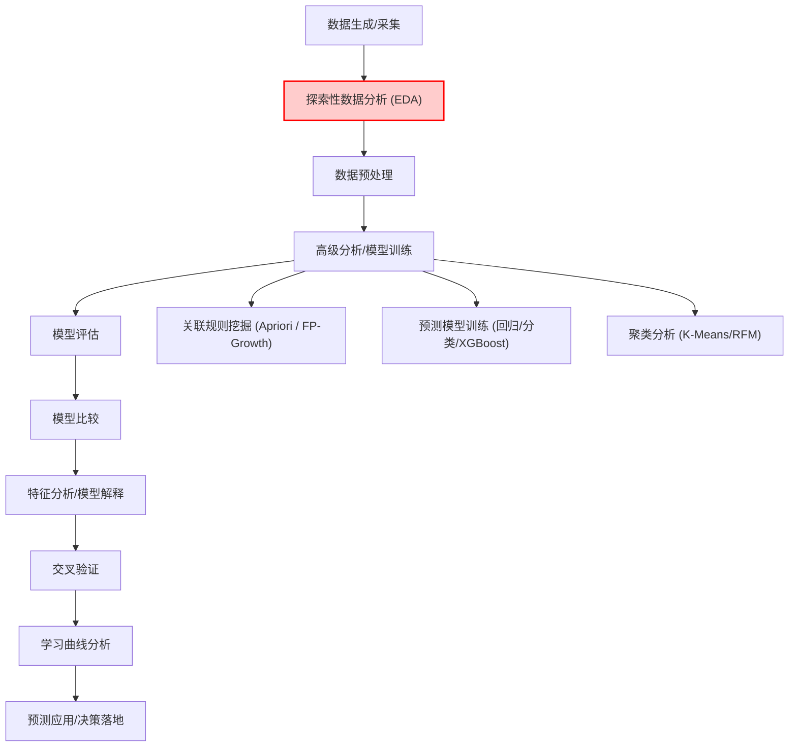

明白，你说得对。其实 **Apriori / 关联规则挖掘** 并不是 EDA 的一部分，而是属于**分析/建模阶段的高级探索**，通常放在 **数据预处理后、模型训练阶段中**，因为它需要干净的、编码好的数据。

我们可以把整个汽车行业分析项目的 pipeline 调整如下：

---

### **汽车行业分析项目 Pipeline（修正版）**

1. **数据生成/采集**

   - 收集销售、库存、客户、配置等原始数据

2. **探索性数据分析 (EDA)**

   - 找异常值、趋势和模式
   - 可视化分布、统计特征、简单聚类

3. **数据预处理**

   - 缺失值处理、异常值处理
   - 编码（One-hot / Label）、标准化 / 归一化

4. **高级分析 / 模型训练**

   - **预测模型**：回归、分类（scikit-learn、XGBoost）
   - **关联规则挖掘**：Apriori / FP-Growth
   - **聚类分析**：K-Means、RFM

5. **模型评估**

   - 预测模型：RMSE、Accuracy、AUC
   - 关联规则 / 聚类：支持度、置信度、提升度

6. **模型比较**

   - 对不同预测模型或规则/聚类方案进行对比

7. **特征分析 / 模型解释**

   - SHAP / LIME，解释模型或规则结果

8. **交叉验证**

   - 验证模型稳健性

9. **学习曲线分析**

   - 查看训练/验证误差随样本量变化

10. **预测应用 / 决策落地**

- 将模型/规则应用到新数据，支持销量预测、组合推荐、营销决策

---

💡 **核心洞察**：

- **找异常值、趋势和模式 → EDA（第 2 步）**
- **Apriori / 关联规则 → 高级分析（第 4 步）**，依赖干净、编码好的数据
- **预测模型训练也在第 4 步**，所以第 4 步通常是 **分析项目中最复杂的阶段**

---

如果你愿意，我可以画一个 **高亮标注 EDA 与 Apriori 的 mermaid 流程图**，让你直观看到这两者在 pipeline 中的相对位置。

你希望我画吗？

明白了，我帮你画一个 **汽车行业分析项目完整 Pipeline 的 mermaid 流程图**，并高亮标注 **EDA（异常值/趋势/模式）** 和 **Apriori（关联规则）** 的位置：

### 🔹 说明

- **红色高亮（EDA）**：找异常值、趋势和模式
- **蓝色高亮（Apriori）**：关联规则挖掘
- 高级分析阶段包括预测模型训练、聚类分析、关联规则挖掘
- Pipeline 顺序依次为：数据采集 → EDA → 数据预处理 → 高级分析 → 模型评估 → … → 预测应用

---

我可以再做一个 **更简洁的 flomo 版**，直接用文字 + icon 高亮 “EDA”和“Apriori”，方便直接放在笔记里。

你希望我做吗？
