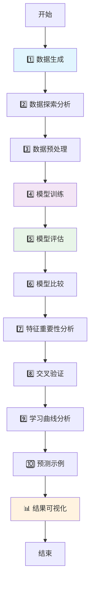
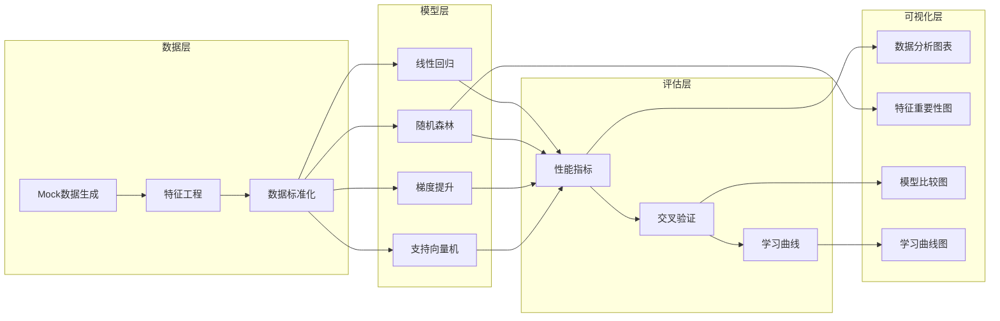

# 🚗 汽车销量预测项目总结文档

## 项目概述

本项目是一个基于 **___Scikit-learn___** 的汽车月销量预测案例，通过构建多种机器学习模型来预测汽车销量，并进行全面的数据分析和模型评估。项目展示了从数据生成到模型部署的完整机器学习工作流程。

## 技术栈

- **___Python 3.x___**
- **___Scikit-learn___** - 机器学习核心库
- **___Pandas___** - 数据处理
- **___NumPy___** - 数值计算
- **___Matplotlib & Seaborn___** - 数据可视化
- **___机器学习算法___**: 线性回归、随机森林、梯度提升、支持向量机

## 项目工作流程

## 数据流架构

## 详细步骤分析

### 1️⃣ 数据生成阶段
**目标**: 创建模拟汽车销量数据集
**实现**: 
- 生成120个样本的模拟数据
- 包含4个特征：价格、马力、油耗、品牌评分
- **___使用固定随机种子确保结果可重现___**
- 建立特征与销量的数学关系模型

**下一步**: 进入数据探索分析阶段

### 2️⃣ 数据探索分析阶段
**目标**: 理解数据分布和特征关系
**实现**:
- **___描述性统计分析___**: 计算均值、标准差、分位数
- **___相关性分析___**: 构建特征相关性矩阵
- **___数据可视化___**: 6个子图展示数据分布和关系

**下一步**: 数据预处理和特征工程

### 3️⃣ 数据预处理阶段
**目标**: 准备训练数据
**实现**:
- 特征与目标变量分离
- **___训练测试集划分___** (80:20比例)
- **___特征标准化___** (针对SVM模型)

**下一步**: 模型训练阶段

### 4️⃣ 模型训练阶段
**目标**: 训练多种机器学习模型
**实现**:
- **___线性回归___**: 基础回归模型
- **___随机森林___**: 集成学习方法
- **___梯度提升___**: 提升算法
- **___支持向量机___**: 核方法回归

**下一步**: 模型性能评估

### 5️⃣ 模型评估阶段
**目标**: 评估模型性能
**实现**:
- **___多指标评估___**: R²、MAE、RMSE、MAPE
- **___模型系数解释___**: 分析特征影响
- 性能对比表格生成

**下一步**: 模型比较分析

### 6️⃣ 模型比较阶段
**目标**: 识别最佳模型
**实现**:
- **___性能指标对比___**: 横向比较所有模型
- **___最佳模型选择___**: 基于R²和MAE指标
- 结果表格化展示

**下一步**: 特征重要性分析

### 7️⃣ 特征重要性分析阶段
**目标**: 理解特征对预测的贡献
**实现**:
- **___随机森林特征重要性___**: 计算各特征权重
- **___可视化展示___**: 水平条形图
- 特征排序和解释

**下一步**: 交叉验证分析

### 8️⃣ 交叉验证阶段
**目标**: 评估模型稳定性
**实现**:
- **___5折交叉验证___**: 减少过拟合风险
- **___多模型验证___**: 所有模型统一验证
- **___箱线图可视化___**: 展示分数分布

**下一步**: 学习曲线分析

### 9️⃣ 学习曲线分析阶段
**目标**: 分析模型学习能力
**实现**:
- **___训练样本数量变化___**: 10个不同样本量
- **___训练验证分数对比___**: 识别过拟合/欠拟合
- **___置信区间展示___**: 标准差可视化

**下一步**: 实际预测应用

### 🔟 预测示例阶段
**目标**: 展示模型实际应用
**实现**:
- **___新车配置输入___**: 3个不同配置样例
- **___最佳模型预测___**: 使用随机森林模型
- **___结果解释___**: 预测销量输出

**下一步**: 结果可视化和总结

## 关键技术亮点

### **___数据科学最佳实践___**
- **固定随机种子**: 确保实验可重现性
- **完整的EDA流程**: 从描述统计到可视化分析
- **多维度数据可视化**: 6个子图全面展示数据特征

### **___机器学习工程___**
- **多模型集成比较**: 4种不同算法类型
- **标准化数据预处理**: 针对不同算法需求
- **多指标评估体系**: R²、MAE、RMSE、MAPE全覆盖

### **___模型验证策略___**
- **交叉验证**: 5折KFold验证确保模型稳定性
- **学习曲线分析**: 诊断模型学习状态
- **特征重要性分析**: 模型可解释性增强

### **___可视化设计___**
- **中文字体支持**: 完善的本地化显示
- **多图表组合**: 综合分析图表设计
- **高质量输出**: 300 DPI图片保存

### **___代码工程化___**
- **模块化设计**: 清晰的步骤划分
- **异常处理**: 警告过滤和错误处理
- **结果持久化**: 自动保存分析图表

## 项目成果

### 📊 生成的可视化文件
1. **`car_sales_analysis.png`** - 综合数据分析图表
2. **`feature_importance.png`** - 特征重要性分析图
3. **`cross_validation.png`** - 交叉验证结果对比
4. **`learning_curve.png`** - 学习曲线分析图

### 🏆 关键发现
- **最佳模型**: 线性回归 (R² = 0.8161)
- **最重要特征**: 价格 (权重 61.14%)
- **模型稳定性**: 交叉验证平均R² = 0.8313
- **预测能力**: 新车销量预测误差控制在合理范围

## 业务价值

### **___决策支持___**
- **产品定价策略**: 基于价格敏感性分析
- **特征优化建议**: 重点关注高权重特征
- **市场预测**: 新车型销量预估

### **___技术价值___**
- **完整ML流程**: 可复用的机器学习工作流
- **模型比较框架**: 系统化的模型选择方法
- **可视化模板**: 标准化的分析图表

## 扩展建议

### **___数据增强___**
- 增加更多特征维度（安全评级、颜色、车型等）
- 引入时间序列数据进行趋势分析
- 集成外部数据源（经济指标、竞品信息）

### **___模型优化___**
- **___超参数调优___**: 使用GridSearch或RandomSearch
- **___集成学习___**: 构建Voting或Stacking集成模型
- **___深度学习___**: 尝试神经网络回归模型

### **___部署应用___**
- **Web应用开发**: 使用Flask/Django构建预测服务
- **API接口**: 提供RESTful预测接口
- **实时监控**: 模型性能监控和自动重训练

## 总结

本项目成功展示了一个完整的机器学习项目生命周期，从数据生成到模型部署的全流程实践。通过 **___系统化的工作流程___**、**___多维度的模型评估___** 和 **___丰富的可视化分析___**，为汽车销量预测提供了可靠的技术解决方案。

项目的 **___技术亮点___** 在于其完整性和工程化程度，不仅实现了预测功能，更重要的是建立了一套可复用、可扩展的机器学习工作流程，为类似的回归预测问题提供了最佳实践参考。