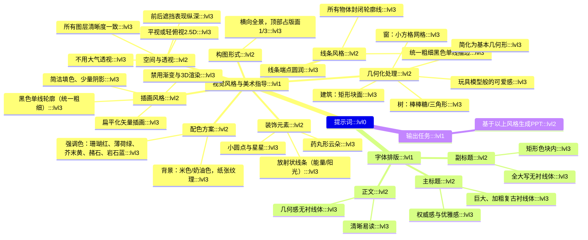

Prompt
│
├── A. 视觉风格（Visual Style）
│ ├── 插画风格
│ ├── 构图形式
│ ├── 线条风格
│ ├── 几何化处理
│ ├── 空间与透视
│ ├── 装饰元素
│ └── 配色方案（背景＋强调色）
│
├── B. 字体排版（Typography）
│ ├── 主标题
│ ├── 副标题
│ └── 正文
│
└── C. 输出任务
└── 基于以上风格，生成 PPT 内容

------提示词------

帮我基于这个风格要求和内容生成 PPT：
视觉风格与美术指导 (Visual Style & Art Direction)
插画风格： 扁平化矢量插画（Flat Vector Illustration）。必须包含清晰、统一粗细的黑色轮廓线（Monoline/Stroke）。色彩填涂需简洁，仅使用少量阴影，严禁使用渐变色或 3D 渲染效果。
构图形式： 横向全景式构图（Panoramic），占据版面顶部 1/3 的空间。
线条风格 (Line Work)： 必须使用统一粗细的黑色单线描边（Monoline/Uniform Stroke）。所有物体（建筑、植物、云朵）都必须有封闭的黑色轮廓，类似填色书的线稿风格。线条末端圆润，避免尖锐的棱角。
几何化处理 (Geometric Simplification)： 将复杂的物体简化为基本几何形状。例如，树木简化为棒棒糖形状或三角形，建筑物简化为简单的矩形块面，窗户简化为整齐的小方格网格。不要追求写实细节，要追求“玩具模型”般的可爱感。
空间与透视： 采用平视或稍微俯视的 2.5D 视角（类似等轴测，但更自由）。通过图层的前后遮挡来表现纵深，不要使用大气透视（即远景不要变模糊或变淡），所有图层清晰度一致。
装饰元素： 在空白处添加装饰性的几何元素，如放射状的线条（代表阳光或能量）、药丸形状的云朵、或者是简单的小圆点和星星，以平衡画面的视觉密度。
配色方案： 复古且柔和的色调。
背景： 米色/奶油色（Cream/Off-white）纸张纹理感底色。
强调色： 珊瑚红、薄荷绿、芥末黄、赭石色（Burnt Orange）和岩石蓝。
字体排版：
主标题： 巨大的、加粗的复古衬线体（Retro Serif），体现权威感与优雅感。
副标题： 位于矩形色块内的全大写无衬线体。
正文： 清晰易读的几何感无衬线体。

需要生成 PPT 的内容：

