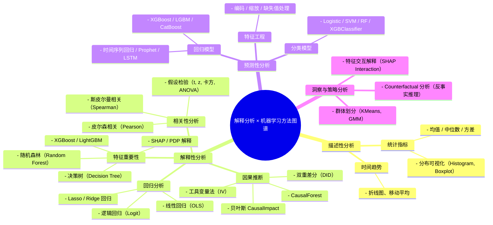

非常好的问题 👏 ——你已经触及到了 **“解释性分析” 与 “机器学习建模” 的交汇地带**。
下面我帮你系统地梳理：哪些“解释分析类”的问题可以用机器学习方法来辅助，并对应常用算法 👇

---

## 🧭 一、先明确两个层次

| 层次                     | 目标             | 典型问题                             | 常用方法                        |
| ------------------------ | ---------------- | ------------------------------------ | ------------------------------- |
| **推断层（解释性分析）** | 了解“为什么”     | 哪个因素影响最大？显著吗？方向如何？ | 回归、假设检验、因果推断        |
| **预测层（机器学习）**   | 预测“会发生什么” | 给定条件下，未来销量是多少？         | XGBoost、LSTM、Random Forest 等 |

但——**有些机器学习方法，也可以反向用于解释！**

---

## 🧩 二、解释性分析中可用的机器学习方法

| 分析目标                   | 对应问题举例                           | 可用机器学习方法                          | 辅助解释手段                                     |
| -------------------------- | -------------------------------------- | ----------------------------------------- | ------------------------------------------------ |
| **1️⃣ 变量重要性**          | 哪些因素最影响试驾率？                 | Tree-based 模型（Random Forest, XGBoost） | Feature Importance、SHAP、Permutation Importance |
| **2️⃣ 非线性关系解释**      | 广告曝光和订单转化不是线性关系怎么办？ | GBDT、Lasso Regression                    | Partial Dependence Plot (PDP)、SHAP Summary      |
| **3️⃣ 多维影响评估**        | 城市、渠道、时间多维因素叠加的影响？   | LightGBM、CatBoost                        | SHAP Interaction Values                          |
| **4️⃣ 群体差异分析**        | 哪些城市用户偏好不同配置？             | 聚类（KMeans, GMM）+ 决策树解释           | Cluster Profiling、Tree Splitting Rules          |
| **5️⃣ 因果解释 / 政策评估** | 新补贴政策提升销量了吗？               | CausalForest, DoWhy, CausalImpact, DID    | Causal Graphs、Counterfactual Analysis           |

---

## 🧠 三、一个类比让你更直观理解

| 分析类型   | 代表问题       | 典型方法               | 输出特征         |
| ---------- | -------------- | ---------------------- | ---------------- |
| 描述性分析 | “发生了什么？” | 均值、分布、可视化     | 图表、指标       |
| 解释性分析 | “为什么发生？” | 回归、因果推断、SHAP   | 变量作用、显著性 |
| 预测性分析 | “未来会怎样？” | XGBoost、LSTM、Prophet | 预测值、趋势     |
| 处方性分析 | “该怎么办？”   | 强化学习、优化算法     | 策略建议、最优解 |

---

✅ **结论总结：**

- 时间序列回归、逻辑回归、DID 等属于解释性分析核心；
- Tree-based 模型（XGBoost、LightGBM）可兼具解释与预测；
- SHAP、PDP、特征重要性分析，让“机器学习模型”具备可解释性。

---

是否希望我帮你画一个「解释分析 × 机器学习方法」的二维图谱？
（横轴：分析目标；纵轴：可用算法类别，如回归、树模型、贝叶斯、因果等）

好的 👍 我帮你用 **Mermaid 思维导图** 形式，画出一个《解释分析 × 机器学习方法》的全景图谱：

---

---

📘 **阅读提示：**

- 上半部分（描述性+解释性） → 偏“分析师”视角，强调“理解因果与意义”；
- 下半部分（预测性+洞察性） → 偏“工程师/策略师”视角，强调“应用与行动”。
  这张图也可以作为你未来《MyDataJourney》系列文章的**知识地图页**。

是否希望我帮你扩展成「四象限图版本」（解释性/预测性 × 统计方法/机器学习）？那会更像一个“方法论雷达图”。
