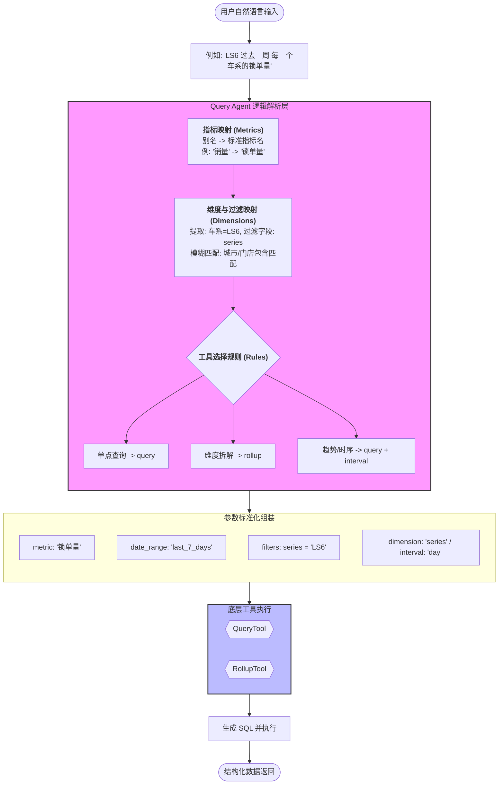

"你的这个文件就是一个 典型的数据查询 Skill YAML，完全符合 Claude Code 高级 Skill 的结构。
它可以直接作为 Query Agent 的 Skill 被 Claude 调用，帮你把自然语言请求自动映射成数据查询参数。"

根据 [query_skills.yaml](file:///Users/zihao_/Documents/github/W52_reasoning/agents/query_skills.yaml) 的配置，Query Agent 将自然语言转化为数据查询指令的完整流程如下：

### 流程核心环节说明：

1.  **语义对齐 (Metric & Dimension Mapping)**：
    - 利用 `metrics` 列表将用户的非规范词（如“销量”、“提车数”）映射为底层物理表对应的 `tool_metric`。
    - 利用 `dimensions` 列表识别用户提到的筛选条件（如“车系”、“城市”），并根据 `filter_field` 确定 SQL 过滤字段。

2.  **逻辑判断 (Rules)**：
    - **工具分流**：如果用户提到“分布”、“按...拆分”，触发 `rollup` 工具；如果提到“趋势”、“每天”，触发带 `interval` 参数的 `query` 工具。
    - **特例处理**：如 `Series vs Series Group` 规则，防止将普通车系名（LS6）错误映射到代码字段（CM2）。

3.  **参数标准化**：
    - 将解析结果组装成 JSON 参数（如 `filters: [{field: 'series', op: '=', value: 'LS6'}]`），这是连接自然语言与底层 Python 工具（`query.py`, `rollup.py`）的标准协议。

4.  **Few-Shot 引导**：
    - `examples` 模块作为 LLM 的“教科书”，通过具体的输入输出对，确保 Agent 在面对复杂组合查询（如“LS6 纯电 2025年12月 上海的开票数”）时能保持极高的转换准确率。
