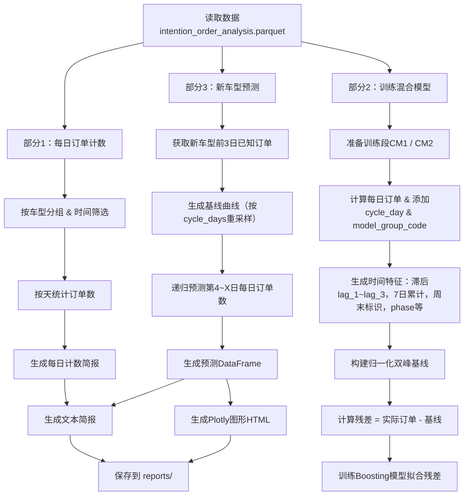

好的，我来帮你总结这个脚本的核心内容和逻辑结构，让你快速理解它做了什么。可以分成几个层次来说明：

---

## **脚本概览**

**脚本功能：**
基于历史车型意向订单数据，按日统计订单数，并构建“BSTS + Boosting”混合模型，预测新车型在指定累计周期内的每日订单数，同时支持可视化和生成文本简报。

**核心流程：**

1. **数据读取与筛选**

   - 默认读取 `intention_order_analysis.parquet`。
   - 根据车型分组 (`model_group`) 和意向支付时间 (`Intention Payment Time`) 筛选数据。
   - 支持自定义数据路径、车型、日期范围。

2. **每日订单统计（部分 1）**

   - 对每个车型分组，统计每日订单数。
   - 生成 `cycle_day`（累计天数）、`model_group_code`（CM1=0, CM2=1）等辅助列。
   - 输出文本报告，可快速查看历史订单趋势。

3. **特征工程**

   - 构造时间特征：星期几、是否周末。
   - 构造滞后特征：`lag_1~lag_3`。
   - 构造累计特征：7 日累计订单 `cum_7`。
   - 构造归一化周期特征：`phase`、`days_to_deadline_norm`，用于刻画双峰模式。

4. **混合建模（部分 2）**

   - **双峰基线**：将 CM1/CM2 样本按归一化相位构建平均曲线，模拟双峰订单分布。
   - **Boosting 模型**：以历史残差（实际订单 - 基线）为目标，训练 XGBoost 或 sklearn 的 `GradientBoostingRegressor`。
   - 特征列包括滞后、累计、时间、车型编码、相位与截止天归一化等。

5. **新车型预测（部分 3）**

   - 输入新车型前 1~3 日真实订单（`initial_daily`），递归预测第 4 ～ X 日。
   - 对每一预测日，构造特征并用 Boosting 模型预测残差，再叠加双峰基线得到最终预测值。
   - 输出包含日期、周期天、预测值、基线值。

6. **可视化与报告生成**

   - Plotly 绘制历史订单曲线 + 新车型预测曲线 + 基线曲线。
   - 生成 HTML 文件保存图表。
   - 生成文本简报，记录历史每日订单、已知新车型前 1~3 日订单，以及第 4 ～ X 日预测结果。

7. **脚本入口与参数**

   - 支持命令行参数，灵活指定：

     - 每日计数的车型和时间范围
     - 训练段 CM1/CM2 的起止日期
     - 新车型预测起止日期、累计周期天数
     - 输出路径（文本和图表）

---

## **特点与亮点**

- **双峰混合建模**：结合归一化基线和 Boosting 残差预测，兼顾周期规律和非线性波动。
- **滞后+累计特征**：利用前 1~3 日订单和 7 日累计，增强短期预测能力。
- **递归预测**：前 1~3 日已知订单，依次预测后续日的订单数，保持时间序列连续性。
- **灵活可视化与报告**：可生成 HTML 图表和文本简报，便于快速汇报。
- **兼容性**：支持 XGBoost 或 sklearn，Plotly 可选。

---

总结一句话：

> 该脚本实现了从历史意向订单统计、特征构造、双峰基线建模、Boosting 残差训练，到新车型递归预测与可视化的全流程，适合短周期车型订单预测和报告生成。

---

如果你愿意，我可以帮你画一张**流程图**，把“数据 → 特征 → 基线 → 残差预测 → 递归预测 → 可视化/报告”整个逻辑用图展示出来，这样更直观。

你希望我画吗？

好的，我可以帮你把你这个脚本的主要流程用 **Mermaid 流程图** 表示出来。你的脚本逻辑大致可以分为三部分：

1. **每日计数（Part 1）**
2. **训练混合模型（Part 2）**
3. **新车型预测与可视化（Part 3）**

下面是一个 **Mermaid 流程图** 示例，展示了数据流与处理步骤：

这个流程图涵盖了：

- 数据读取 → 日计数 → 文本报告
- CM1/CM2 训练段 → 特征生成 → 双峰基线 → 残差 → Boosting
- 新车型预测 → 基线 + 递归预测 → 输出预测表 + 图形

---

如果你愿意，我可以帮你画一个 **更精细的 Mermaid 图**，把 **每个函数和关键计算（如 lag、cum_7、phase、residual）** 都标出来，让整个脚本逻辑几乎像代码执行流程图一样清晰。

你希望我画这个更详细版吗？

## 为什么“经验+Boosting 更加合适？”

从你的项目特点来看，我倾向认为 **“经验双峰基线 + Boosting”** 已经是更实际的方案，原因如下：

---

### 1️⃣ 数据特点

- **周期短、样本少**：你用的是每天订单数、累计周期只有几天（X 天），每个车型只有几十天的数据。

  - BSTS 的优势在于长时间序列（几个月到几年），能够估计趋势、季节和不确定性。
  - 短周期、高波动的情况下，BSTS 可能**过拟合或收敛不稳**。

- **目标是新车型预测**：

  - 新车型历史数据非常少（前 1 ～ 3 天），BSTS 在缺乏历史趋势的情况下很难发挥。
  - 经验曲线（双峰）+ Boosting 用已有车型 CM1/CM2 规律来校正残差，更符合迁移思路。

---

### 2️⃣ 业务需求

- **预测目的是订单数，强调可解释与快速迭代**：

  - 经验曲线容易理解（双峰结构：前期订单冲、高峰尾部），业务可快速验证。
  - Boosting 修正残差，处理非线性和特殊行为（周末效应、滞后影响等）。

- BSTS 更强调**不确定性量化**和贝叶斯推断，但你项目当前重点是预测量级，而不是置信区间，这部分价值不大。

---

### 3️⃣ 技术成本

- 引入 BSTS：

  - 需要 `pystan` 或 `prophet` 或其他贝叶斯包，建模、调参、采样都比较耗时。
  - 对于短周期新车型数据，可能效果不如经验曲线稳健。

- 当前方案：

  - 基于历史车型曲线归一化 + Boosting，容易扩展到新车型和新周期。
  - 可解释性好，维护成本低。

---

### ✅ 总结

| 方案                    | 优点                                   | 缺点                             | 适合度 |
| ----------------------- | -------------------------------------- | -------------------------------- | ------ |
| 经验双峰基线 + Boosting | 短周期、少数据稳健；快速可解释；低维护 | 无法给完整贝叶斯不确定性         | 高     |
| BSTS + Boosting         | 可量化不确定性；趋势建模更科学         | 短周期数据不稳；采样慢，调参复杂 | 低     |

---

💡 **建议**：

- **保持当前经验+Boosting**为主，专注优化基线拟合、Boosting 特征和滞后/累计特征。
- 如果未来数据量大（几十天甚至几个月的新车型销售数据），可以考虑引入 BSTS 来增强趋势捕捉和置信区间分析。

---

如果你愿意，我可以帮你画一张 **经验+Boosting 与 BSTS+Boosting 流程对比图**，用 mermaid 或可视化流程图，看起来一眼就明白。

你希望我画吗？
