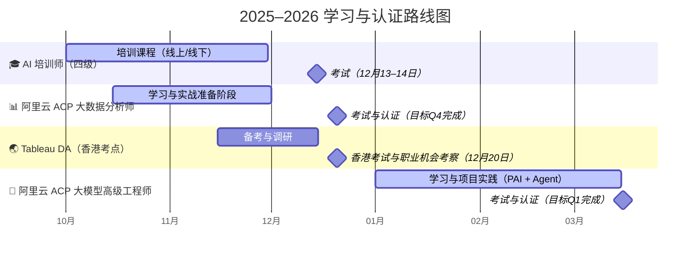

## 认证

| 时间                     | 学习重点                                       | 认证/考试                                 | 目标产出                                   | 备注                                                |
| ------------------------ | ---------------------------------------------- | ----------------------------------------- | ------------------------------------------ | --------------------------------------------------- |
| **2024.10–11**           | 🎓 **人工智能培训师（四级）培训**              | 培训阶段（线下或线上）                    | 建立 AI 教学与理论框架                     | 属于国家职业技能标准体系（可作为 AI 教学/讲师资质） |
| **2024.12.13–14**        | 考前复习 + 实操演练                            | **人工智能培训师（四级）考试**            | 获得 AI 培训与认知框架认证                 | 建议整理为“AI 教育模块”项目成果                     |
| **2024.12.20（待定）**   | **香港行：Tableau DA 考试考点确认 + 职业调研** | Tableau Desktop Specialist / Data Analyst | 了解国际考试路径与香港数据岗位生态         | 可作为“数字游民+BI 国际化路径”探索                  |
| **2025.Q1–Q3（准备期）** | 阿里云生态熟悉、DataWorks / QuickBI 实践       | —                                         | 熟悉阿里云控制台与大数据产品生态           | 可并行推进你现有 DuckDB + LangGraph 系统            |
| **2025.Q4（正式目标）**  | 📊 **阿里云 ACP 大数据分析师认证**             | 考试与项目实战                            | 完成智能中台数据管线、SQL 分析、可视化项目 | 建议用你的 Copilot 系统做实战项目，生成作品集       |
| **2026.Q1（进阶阶段）**  | 🤖 **ACP 大模型高级工程师认证**                | 考试与 AI 项目落地                        | 完成 AI Agent + 模型推理产品原型           | 可作为你“AI Copilot 产品孵化”的关键节点             |

## 学习与成果节奏建议（每月）

| 月份              | 关键任务                                        | 产出                                         |
| ----------------- | ----------------------------------------------- | -------------------------------------------- |
| **10 月**         | 启动 AI 培训师课程；记录学习日志                | 《AI 教学与认知框架》笔记                    |
| **11 月**         | 培训师课程冲刺 + 实操演练                       | 模拟授课视频 / 小项目案例                    |
| **12 月**         | 培训师考试（13–14）+ Tableau 香港考察（20）     | 考试完成 + Tableau 考试可行性报告            |
| **2025.1–3 月**   | 阿里云生态学习；准备大数据 ACP；复盘 2024 项目  | 大数据 ACP 学习笔记 + LangGraph 数据管线优化 |
| **2025.4–9 月**   | 模拟项目实战（结合 DuckDB 系统）；报名 ACP 考试 | “智能中台数据 Copilot”项目成果               |
| **2025.10–12 月** | 通过 ACP 大数据分析师认证                       | 认证+项目展示页                              |
| **2026.1–3 月**   | 备考大模型 ACP + 开发 AI Agent 产品             | “AI 策略 Copilot”产品原型 + 认证完成         |

## 整体时间轴（2025.10 – 2026.03）

---

### 🧭 图表说明

- 横轴是时间线（从 2025 年 10 月到 2026 年 3 月）
- 每个阶段用一个 section 表示
- `:milestone` 表示明确的考试或关键成果时间点
- `:active` 表示学习或准备期

---

是否希望我帮你加上颜色标识（比如不同类型：学习期=蓝色、考试=橙色、职业探索=绿色），让整张图更直观？
